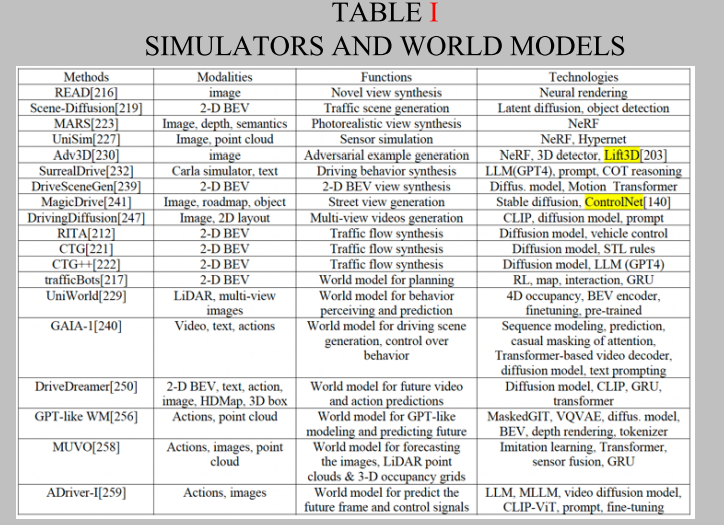
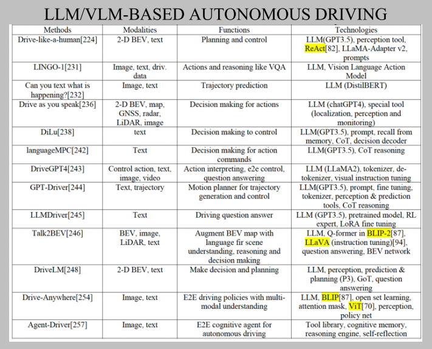

# Applications of Large Scale Foundation Models for Autonomous Diving

[paper](https://arxiv.org/abs/2311.12144)
作者单位 Futurewei Technology Inc

By combining LLM with foundation models, it is possible to utilize the human knowledge, commonsense and reasoning to rebuild autonomous driving systems from the current long-tailed AI dilemma.
利用大模型的人类知识、常识、推理解决长尾困境

本文涉及大模型自动驾驶
simulation， world model， data annotation and planning or E2E solutions

Transformer的几个变种
- MQA (multi-query attention, kv are shared across all heads)
- Switch Transformer (MoE)
- FlashAttention
- PageAttention
- RoPE (Rotary Position Embedding, relative position dependency, flexibility of sequence length)

frameworks:
- Megatron-LM
- lightLMM
- vLLM

LLM abilities:
- in-context learning
- instruction following
- reasoning with CoT

[World models](https://arxiv.org/abs/2308.10901) explicitly represent the knowledge of an autonomous agent about its environment. They are defined as a generative model that predicts the next observation in an environment given past observations and the current action.
世界模型描述的是智能体对环境的理解。通常是被定义为一个生成式模型，根据当前动作和过往观察生成下一时刻对环境的观察。

Conclusions:
- language model + diffusion model + NeRF will be the trend to realise photorealistic sensor data and human like traffic flows
- automatic annotation, MLLM VLM provide the possibility of open vocabulary scene understanding
- decision making and E2E, prefer integration of LLM or MLLM. Either pretained foundation models or tokenization like NLP's GPT sounds to be strong owner of AD large scale models, however the performance is more difficult to realize the grounding capabilities due to limited data collection and concern of hallucination.