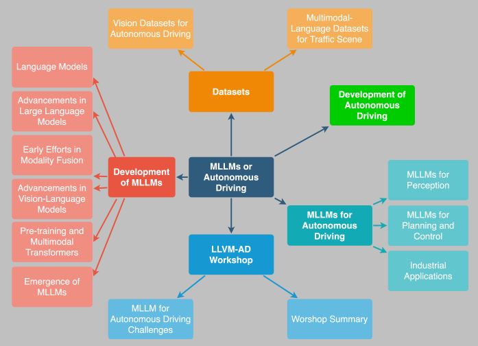
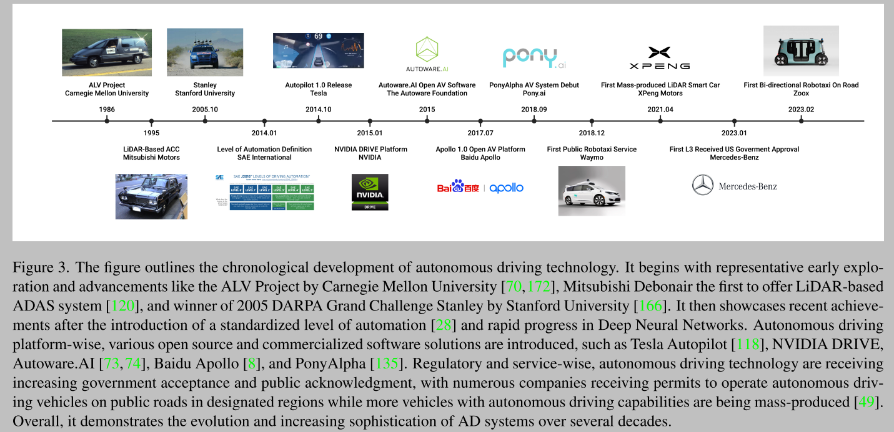
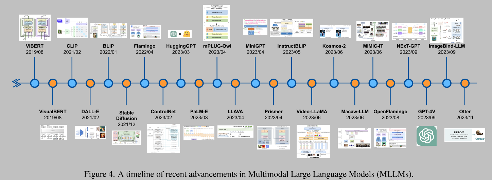
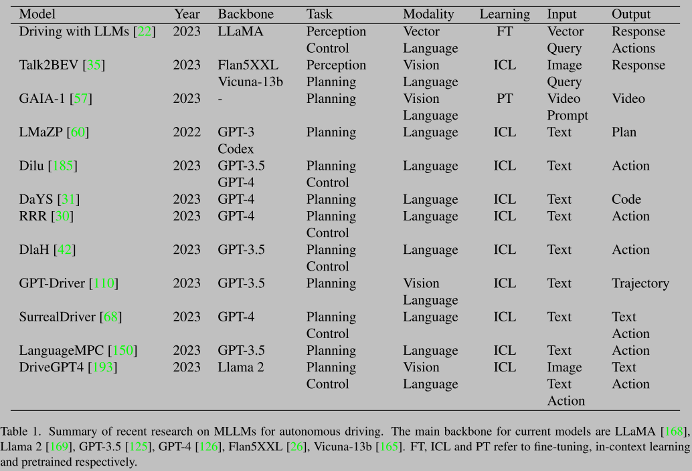
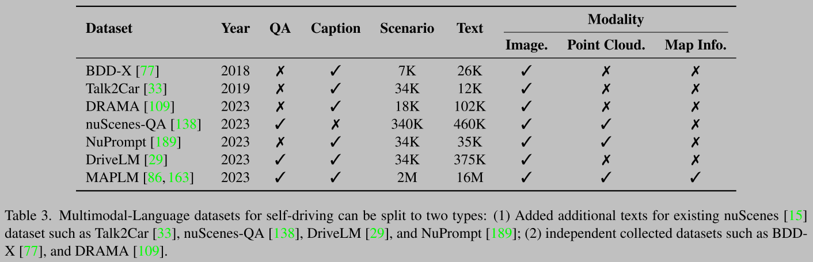

# A Survey on Multimodal Large Language Models for Autonomous Driving

[paper](https://arxiv.org/abs/2311.12320)
作者单位 普渡大学， Tencent T Lab， [PediaMed AI](https://pediamedai.com/team/)... 

Overview:
- background of MML
- models development
- history of autonomous driving

Main Content:
Merging linguistic communication with multimodal sensory inputs like panoramic images, LiDAR point clouds, and driving actions could revolutionize the foundation models that govern current autonomous driving systems

It is undeniable that integrating LLMs into the AV industry can bring a significant paradigm shit in vehicle intelligence, decision-making, and passenger interaction, offering a more user-centric, adaptable, and trustworthy future of transportation.
语言模型在车辆智能、决策、乘客交互上体现以人为本、可适配、可信的未来交通愿景。

LanguageMPC： enable the customization of controller parameters to align with driver preferences, achieving personalization in the driving experience.

In future SAE L4-L5 autonomous vehicles, passengers could communicate their requests while driving using language, gestures, or even gazes, with the MLLMs offering real-time in-cabin feedback by integrating visual displays or voice responses.

driving edge cases such as extreme weather, bad lighting conditions or rare situations

Waymo Open Sim Agents Challenge is the first public challenge to develop simuations with realistic and iteractive agents

[VLAAD: Vision-and-Language-Assistant-for-Autonomous-Driving](https://github.com/sungyeonparkk/vision-assistant-for-driving)

LLM use cases for AD:
- planner: FLOPS, latency, power consumption, bandwidth
- navigation planner: [SayNav](https://arxiv.org/abs/2309.04077), [Nav-LLM](https://arxiv.org/abs/2310.10103)
- user-vehicle interaction
- HD map understanding: [Tesla Analysis](https://kevinchen.co/blog/), Baidu ERNIE-GeoL, Tencent THMA
